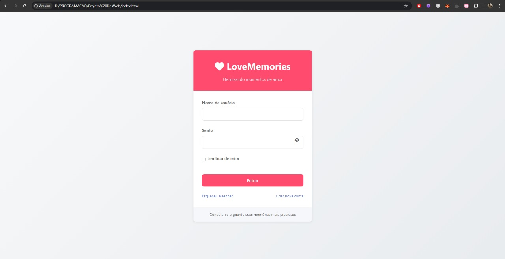
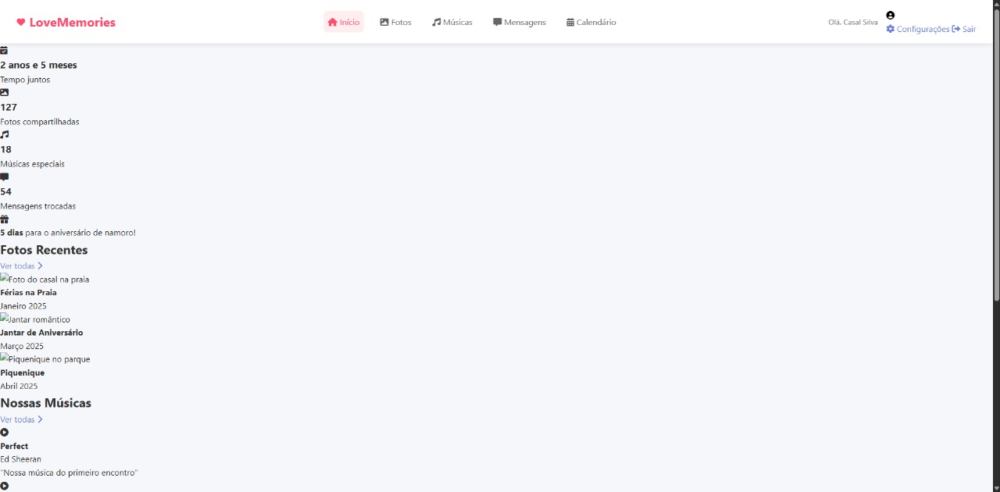

# LoveMemories


## 💘 Sobre o Projeto

LoveMemories é uma plataforma digital íntima onde casais podem eternizar suas memórias afetivas juntos. O sistema permite que parceiros compartilhem um espaço digital exclusivo onde podem colecionar, organizar e revisitar momentos especiais de sua história, criando uma cápsula do tempo digital de seu relacionamento.

Este projeto foi desenvolvido como trabalho para a disciplina de **Desenvolvimento de Sistemas Web I** sob orientação do Prof. Jair C Leite.

## ✨ Características Principais

- **Galeria de Fotos**: Upload de imagens com título e descrição para registrar momentos visuais importantes
- **Playlist de Músicas Especiais**: Registro de músicas significativas com título e descrição do seu significado
- **Cards de Mensagens**: Troca de mensagens de carinho e momentos especiais entre o casal
- **Calendário de Datas**: Registro e lembretes de ocasiões importantes no relacionamento

## 🔐 Privacidade e Segurança

O LoveMemories foi projetado com foco total na privacidade. Cada casal tem seu próprio espaço digital protegido, com login duplo para garantir que apenas os dois parceiros tenham acesso às suas memórias compartilhadas.

## 🛠️ Tecnologias Utilizadas

- **Frontend:**
  - HTML5
  - CSS3
  - JavaScript

- **Recursos:**
  - Design responsivo para adaptação a diferentes dispositivos
  - Interface intuitiva e amigável
  - Animações e transições suaves para melhor experiência de usuário

## 📱 Capturas de Tela

### Página de Login


### Dashboard Principal


## 📋 Funcionalidades Planejadas

### Já Implementadas:
- Sistema de login e registro
- Dashboard principal com visão geral das memórias
- Exibição de estatísticas do relacionamento
- Listagem de fotos recentes
- Listagem de músicas especiais
- Visualização de mensagens recentes
- Calendário de datas importantes

### Futuras Implementações:
- Upload de fotos reais
- Notificações de aniversários e datas especiais
- Temas personalizáveis para a interface

## 🚀 Como Executar o Projeto

1. Clone este repositório:
```bash
git clone https://github.com/Dargonize/LoveMemories.git
```

2. Navegue até o diretório do projeto:
```bash
cd LoveMemories
```

3. Abra o arquivo `index.html` em seu navegador:
```bash
# No Linux
xdg-open index.html

# No macOS
open index.html

# No Windows
start index.html
```

## 👥 Sobre o Autor

Este projeto foi desenvolvido como trabalho acadêmico para a disciplina de Desenvolvimento de Sistemas Web I.
Por Daniel Alen.